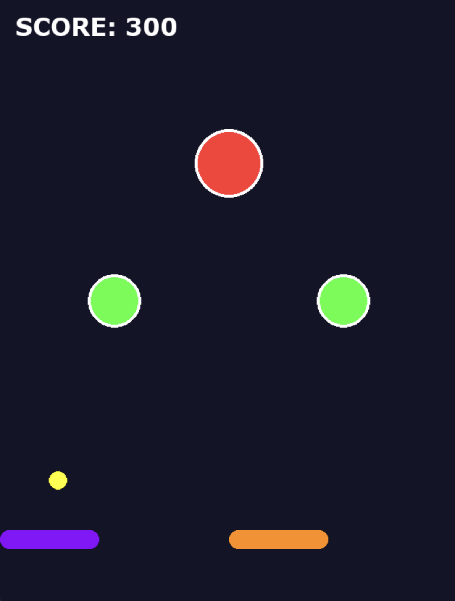

# JoJo Pinball Adventure ⭐️👊

A high-speed, stylized pinball game built with Python and Pygame, themed after *JoJo's Bizarre Adventure*. Use your flippers to keep the "Golden Spirit" ball in play and rack up points by hitting Stand-infused bumpers!

---

## 📸 Game Previews

| **Evolution of Play** |
| :--- | :--- |
|  |
| *Mastering the flipper timing.* | *Navigating complex platform layouts.* |

---

## 🚀 Features

* **Custom Physics Engine:** Realistic gravity, friction, and vector-based reflections.
* **Stand Bumpers:** High-velocity bumpers that add 100 points per hit and boost ball speed by 1.4x.
* **Themed Aesthetics:** * **Golden Spirit Ball:** A high-visibility yellow ball with a white outline.
    * **Custom Background:** Dynamically loads `jojo.background.png` for a true JoJo atmosphere.
* **Precision Flippers:** Independent left (Purple) and right (Orange) flippers for total control.
* **Automatic Reset:** If the ball falls out of bounds, the score resets and a new ball is launched instantly.

---

## 🎮 How to Play

### Controls
* **[A] Key**: Activate Left Flipper
* **[D] Key**: Activate Right Flipper
* **[Esc]**: Close the game

### Mechanics
Hit the circular bumpers to increase your score. The ball will bounce back with increased speed, so stay sharp! If the ball passes the flippers, your score resets to 0.

---

## 🛠️ Technical Details

* **Language:** Python 3.x
* **Library:** Pygame
* **Screen Format:** 600x800 Portrait
* **Key Constants:**
    * `Gravity`: 0.2
    * `Friction`: 0.995
    * `Bumper Multiplier`: 1.4x

---

## 📂 Project Structure

As seen in the repository:
* `main.py`: The core game loop and physics logic.
* `jojo.background.png`: The custom game arena background.
* `scorea.png` / `scoreb.png`: UI assets for the scoring system.

---

*Note: This is a fan project. JoJo's Bizarre Adventure is the property of Hirohiko Araki and Shueisha.*
